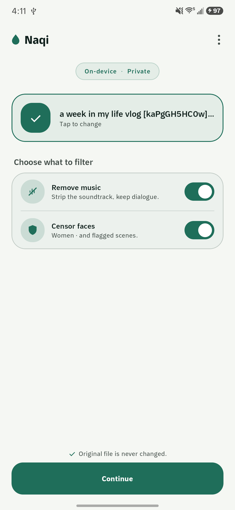
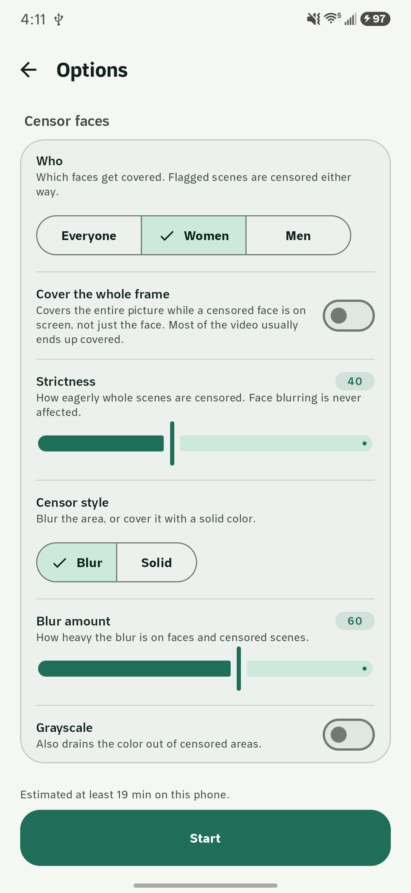
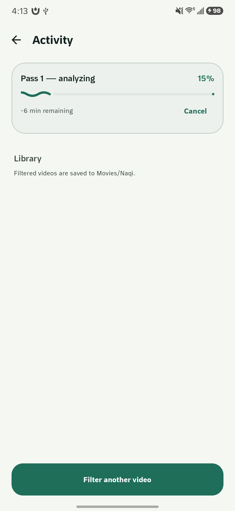
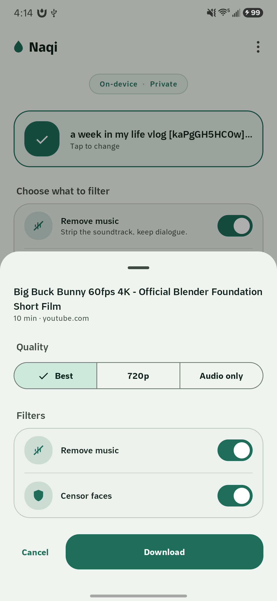
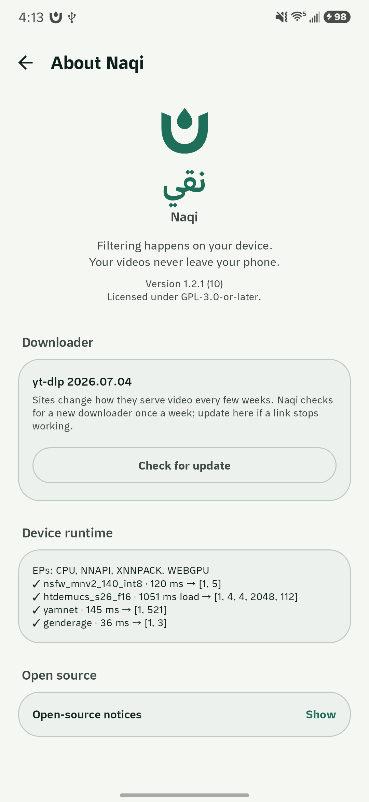

# Naqi — Halal Video Filter

Android app that filters video **entirely on-device**: removes music from the audio and censors
women in the picture. No cloud, no accounts, no telemetry. The original file is never modified.

*Naqi (نقي) means "pure" in Arabic.*

<p align="center">
  
  
  
  
  
</p>

## What it does

Two independent operations, run alone or together:

- **Remove music** — htdemucs stem separation splits the audio and keeps only the stems you choose
  (`vocals`, or `vocals + other` to retain sound effects at the cost of some music leakage).
  Drums and bass are never kept.
- **Censor women** — ML Kit finds and tracks faces, NudeNet votes on gender per track, and female
  tracks are blurred for their whole span. An NSFW classifier gate additionally censors the entire
  frame while it fires, with pre-roll so nothing slips through on the first frame.

Adjustable: blur amount, grayscale toggle, NSFW strictness (0–100), and whether faces of
unresolvable gender get blurred.

Also included:

- **Download by link** — share a video URL into Naqi and it fetches the file with yt-dlp, then
  filters it. The download goes to a quarantine directory and is only published once complete.
- **Share into Naqi** — share a video from any app and it queues for filtering straight away, with
  the filters you used last time already selected. Share several and they run in order.
- **Long videos** — feature-length input checkpoints per segment and survives process death, a
  reboot, and the 6-hour foreground-service cap.
- **English and Arabic**, with per-app language selection on Android 13+.

## Privacy

All inference runs locally. The app requests `INTERNET` for exactly two things: the optional
one-time model download and the link-download feature you explicitly invoke. Nothing is uploaded,
there are no analytics SDKs, and no account is required.

## Install

Grab the APK from [Releases](https://github.com/haithamassoli/NaqiHalalVideoFilter/releases).

**The APK here is the full build.** Download-by-link and share-into-Naqi ship only in this one. A
Play Store build cannot carry them: yt-dlp fetches and updates executable code at runtime, which
Play's Device and Network Abuse policy does not allow. The filtering itself is the same either way.

**Requirements:** Android 10 (API 29) or newer, **arm64-v8a** only. Free space of roughly
2× the video size. The APK is large because the ONNX models ship inside it.

## Build from source

The models are gitignored (117 MB of ONNX), so a fresh clone must fetch them first:

```bash
./scripts/fetch-models.sh     # NudeNet downloads directly
```

`nsfw_mnv2_140_f32.onnx` and `htdemucs_s26_f16.onnx` are locally converted artifacts with no public
host — the regeneration pipelines (venvs, commands, parity checks) are in
[`docs/m0-spikes.md`](docs/m0-spikes.md). Alternatively, host them yourself and pass
`-PnaqiModelBaseUrl=https://your-host/path` so the app downloads them on first use instead.

Then:

```bash
./gradlew assembleDebug
./gradlew compileDebugKotlin testDebugUnitTest   # the green gate
```

Signing a release build needs four Gradle properties — put them in `~/.gradle/gradle.properties`,
never in the repo:

```properties
naqiStoreFile=/absolute/path/to/naqi.jks
naqiStorePassword=...
naqiKeyAlias=...
naqiKeyPassword=...
```

Without them `assembleRelease` still builds, just unsigned.

## How it works

Analysis and rendering are two separate passes, and that is not an optimization — majority-vote
gender needs the complete face track before its first frame can be rendered, and the censor
pre-roll needs the NSFW timeline ahead of the encoder.

**Pass 1 (decode only)** samples the NSFW gate at 5 fps and faces at 10 fps, resolves gender from
up to 5 frontal crops per track, and emits an EDL: censor intervals plus per-frame face regions.

**Pass 2** replays the EDL through a Media3 Transformer GL shader — full-frame effect wins over
face regions — and encodes H.264. Censor-only jobs pass the audio through untouched; music-only
jobs remux the original video samples with no re-encode at all.

Audio decodes to 44.1 kHz f32 stereo, runs htdemucs in overlapping chunks, and sums only the kept
stems per chunk as they resolve, so a 2-hour film never materializes four full stems in memory.

More detail lives in [`docs/prd-video-filter-android.md`](docs/prd-video-filter-android.md) and
[`docs/long-film-plan.md`](docs/long-film-plan.md).

## Accuracy, honestly

The models are good, not perfect. A face never seen frontally may go unresolved. High strictness
deliberately over-censors — that is the safe direction, and it is the intended behaviour, not a
bug. Music removal keeps singing along with dialogue, because to a stem separator they are the
same thing.

## Licence

**GPL-3.0-or-later.** See [`LICENSE`](LICENSE). Naqi links youtubedl-android (GPL-3.0), which is
what determines the licence of the whole.

⚠️ Two bundled models carry terms that are **not yet resolved**: NudeNet v3 320n is AGPL-3.0 and
the NSFW gate weights are NOASSERTION upstream. The details and the reasoning are in
[`NOTICE`](NOTICE) — read it before redistributing this app or shipping it to an app store.
Full third-party attribution is in the same file, and the app surfaces it in-product under
About → Open source licenses.
