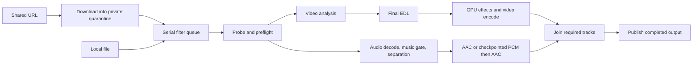

# Download, Blur, and Music Removal: Performance and Hardware Utilization Plan

Date: 2026-09-22

Initial code review: `26e9119`; first implementation batch reviewed against `7cc1131`.

Status: implementation started on 2026-09-26. See section 14 for completed checks and remaining device measurements.

## 1. Requirements and scope

The objective is to shorten the time from starting a download or selecting a local file to receiving a correctly filtered output, on a broad range of Android devices, including midrange phones.

The user confirmed two separate choices:

1. **Maximum performance:** use more processing resources when this improves completion time, while preserving filtering behavior and output quality.
2. **Faster processing with lower quality:** allow an explicit quality tradeoff, independently of the performance setting.

Keep on-device processing, private download quarantine, cancellation, resumable long jobs, and publication only after successful completion. Preserve the existing user choices for whom to censor, whole-frame versus regional censorship, blur strength, NSFW strictness, and retained audio stems.

This plan covers CPU threads, GPU effects, hardware codecs, optional neural accelerators, memory, storage, network transfers, sustained thermal behavior, and Android background execution. It does not require a new processing framework or a new runtime as the first step.

The current build targets API 36, supports API 29 and above, and packages only `arm64-v8a`. Broad device support in this plan means broad coverage within that existing platform boundary; adding 32-bit support is a separate project. Dependencies currently include ONNX Runtime 1.27.0, Media3 1.10.1, WorkManager 2.11.2, and youtubedl-android 0.18.1. See [build configuration](../app/build.gradle.kts) and [dependency versions](../gradle/libs.versions.toml).

## 2. How the current implementation works

### 2.1 Download and queue

Relevant code: [Downloader.kt](../app/src/main/java/com/haithamassoli/naqi/download/Downloader.kt), [DownloadWorker.kt](../app/src/main/java/com/haithamassoli/naqi/download/DownloadWorker.kt), [JobController.kt](../app/src/main/java/com/haithamassoli/naqi/work/JobController.kt), and [Queue.kt](../app/src/main/java/com/haithamassoli/naqi/work/Queue.kt).

1. A shared URL becomes a queued `DownloadWorker`. Local files enter the filter queue directly.
2. `Downloader` initializes bundled Python, yt-dlp, and FFmpeg. A weekly extractor update, or one recovery update after a yt-dlp failure, may precede the transfer.
3. yt-dlp chooses Best, 1080p, 720p, 480p, or Audio using fixed format selectors. Audio-only requests extract/convert to M4A. Separate video/audio streams may require FFmpeg merging.
4. Downloads go to `noBackupFilesDir/naqi-downloads/<urlKey>/`. Partial files survive retry. Storage is checked before downloading and during progress callbacks.
5. One mutex serializes yt-dlp downloads and updates. The download work chain is also serial. There is no explicit `--concurrent-fragments` setting today.
6. A completed file is appended to the separate filter work chain. **Downloading the next item can already overlap filtering the previous item.** Filtering a file does not start while that same file is incomplete.
7. If no filter was requested, the download worker publishes the original. Otherwise, only the filter worker publishes the result. The quarantined original is deleted after successful publication.

Download time includes extractor startup/update, metadata resolution, transfer, and merge/conversion. A faster network transfer can still produce a slower overall job if its selected codec is expensive to decode or its audio requires another conversion.

### 2.2 Analysis and blur

Relevant code: [FilterWorker.kt](../app/src/main/java/com/haithamassoli/naqi/work/FilterWorker.kt), [FrameSampler.kt](../app/src/main/java/com/haithamassoli/naqi/analysis/FrameSampler.kt), [FaceTracker.kt](../app/src/main/java/com/haithamassoli/naqi/analysis/FaceTracker.kt), [Infer.kt](../app/src/main/java/com/haithamassoli/naqi/ml/Infer.kt), [Edl.kt](../app/src/main/java/com/haithamassoli/naqi/edl/Edl.kt), and [CensorEffect.kt](../app/src/main/java/com/haithamassoli/naqi/render/CensorEffect.kt).

**Analysis pass:**

- `MediaExtractor` and `MediaCodec` decode the source sequentially. Sampling at 10 fps reduces analysis calls; it does not mean only ten compressed frames per second are decoded.
- Selected images are converted to NV21 with a maximum dimension of 640 for ML Kit FAST face detection and tracking. A bounded channel of two frames and a four-slot buffer ring overlap production and consumption.
- Every second sampled frame supplies a separate 224 × 224 tensor for the NSFW gate: nominally 5 fps. These pixels are gathered from the source image, not from the reduced NV21 image.
- The NSFW model is **already statically quantized INT8**. Its session uses XNNPACK with four threads, ORT intra-op set to one, and ORT spinning disabled. The same session-options helper is also used by the gender classifier and YAMNet.
- Face detection starts asynchronously while gate preprocessing and inference run. The consumer then blocks in `Tasks.await` before using the same ring-owned image for tracking and optional gender classification.
- Women/Men modes classify a limited number of sufficiently large face crops per track. Ties, missing classification, and uncertain votes censor the track. Everyone skips this classifier.
- NSFW detections receive 500 ms of pre-roll and 1,500 ms of post-roll. More than eight concurrent face regions are promoted to full-frame censorship before reaching the shader.
- The edit decision list (EDL) stores full-frame intervals and face tracks. Whole-frame mode merges eligible spans with a 400 ms bridge and applies a 500 ms minimum duration. These are output semantics, not scheduling details.

**Render pass:**

- Media3 Transformer reads the video again, uses a custom OpenGL shader, and normally encodes H.264.
- Blur already runs on the **GPU**. It uses a downscaled intermediate texture, horizontal and vertical Gaussian passes, and a full-resolution composite. Unaffected frames skip the blur passes; they still pass through the export pipeline when an export needs effects.
- The shader output texture pool is **already three**, not one. Solid-color mode already avoids the blur passes.
- Empty EDLs on the unsegmented path can use Transformer passthrough. This is safe only after analysis has established that the EDL is final.
- HDR inputs that require effects currently use OpenGL tone mapping to SDR. Preserving current quality means preserving that existing policy; it does not promise original HDR or lossless re-encoding.

Transformer already uses MediaCodec and OpenGL; moving blur to GPU is therefore not new work. Actual selected codecs still need to be recorded on each device. [Media3 Transformer architecture](https://developer.android.com/media/media3/transformer).

### 2.3 Music removal

Relevant code: [AudioPipeline.kt](../app/src/main/java/com/haithamassoli/naqi/audio/AudioPipeline.kt), [AudioDecoder.kt](../app/src/main/java/com/haithamassoli/naqi/audio/AudioDecoder.kt), [MusicGate.kt](../app/src/main/java/com/haithamassoli/naqi/audio/MusicGate.kt), [DemucsSeparator.kt](../app/src/main/java/com/haithamassoli/naqi/audio/DemucsSeparator.kt), [Dsp.kt](../app/src/main/java/com/haithamassoli/naqi/audio/Dsp.kt), and [AacWriter.kt](../app/src/main/java/com/haithamassoli/naqi/audio/AacWriter.kt).

1. `AudioDecoder.stats` estimates normalization statistics. For known durations over 80 seconds, it samples twenty two-second windows; short or unknown-duration sources use a full decode. The old proposal to remove a full first pass has therefore largely been implemented.
2. MediaCodec decodes audio. The app downmixes to stereo and resamples the processing stream to 44.1 kHz using Sonic when needed.
3. A decoder coroutine feeds copied PCM batches into a bounded queue. This producer is already separate from the inference driver.
4. YAMNet scoring and guard logic exist, but both production audio paths currently pass a null gate because bypassing chunks missed audible music. HTDemucs therefore processes every chunk. Re-enabling bypass requires a separate recall and listening gate.
5. HTDemucs processes 2.6-second segments with a 103,194-frame stride, approximately 10% overlap, and a deterministic half-second initial shift. Kotlin performs STFT, inverse STFT, and overlap-add around the ONNX graph.
6. HTDemucs uses the **CPU execution provider**, with up to six intra-op threads and spinning disabled. CPU arena allocation and memory-pattern optimization are disabled. FP16 in the artifact name describes stored weights; it does not establish GPU or native FP16 execution.
7. The model computes four stems. Java copies out only vocals, or vocals plus other, according to the user's selection. Selecting one stem saves output copying and downstream work; it does not eliminate the graph's computation of the other stems.
8. Short jobs feed a separate AAC writer coroutine through a two-batch queue. Long resumable jobs instead append int16 PCM and checkpoint progress, then encode the completed PCM in a final pass. These paths have different bottlenecks.
9. AAC output is currently 44.1 kHz stereo at 192 kbps. Music-only video jobs copy the original video samples and replace the audio; they do not re-encode video.

The decoder queue is bounded at **512 PCM batches**, not 512 audio samples. Its actual memory and time depth depend on decoder batch sizes and must be measured.

The retained `vocals` stem may include singing, and `other` can include musical instruments. Preserve these existing meanings in performance work; neither setting is equivalent to a guaranteed speech-only track. Changing that product behavior requires its own quality evaluation.

### 2.4 Scheduling, long jobs, and publication

The diagram shows a combined job. Audio and the analysis-then-render branch already overlap when the phone is not a low-RAM device and reported total memory is at least 6,656 MiB. Otherwise they run sequentially. A RAM threshold alone does not establish the best schedule for a particular CPU, codec, or thermal state.

| Job shape | Current work |
|---|---|
| Download without filters | Download, merge/extract if needed, publish |
| Censor only | Analyze, render, publish; original audio is retained where compatible |
| Music only, with video | Separate audio, copy original video while remuxing, publish |
| Combined | Audio branch alongside analysis then render when eligible; final remux |
| Long visual job | Analyze/checkpoint five-minute segments, build global EDL, render/checkpoint segments, concatenate |
| Audio-only source | Separate and publish M4A; the first implementation batch enables PCM checkpoints when duration is known and long enough |

The normal long-job threshold is 30 minutes. Segment boundaries are snapped to source sync samples where possible. Final concatenation uses absolute source offsets and one continuous audio track. Combined and remux paths already write directly to a pending MediaStore file descriptor, avoiding an extra full-video copy.

The first implementation batch addresses two performance-reliability gaps: audio-only jobs now read duration from the container/audio track to select resumable separation, and music-only failures report retained progress as resumable. Device interruption tests remain outstanding. See [Checkpoint.kt](../app/src/main/java/com/haithamassoli/naqi/work/Checkpoint.kt) and [Publish.kt](../app/src/main/java/com/haithamassoli/naqi/work/Publish.kt).

## 3. Evidence, existing improvements, and remaining uncertainty

Use source code for current behavior and older documents for historical observations. This plan is the proposed implementation order; it does not replace the earlier experiment records.

The strongest existing baseline is [perf-plan-v5.md, section 8](perf-plan-v5.md#8-measured--s23-benchmark-build-2026-08-06), recorded on a Galaxy S23 with a non-debuggable benchmark build and a 1,522-second, 1080p H.264/AAC source.

| Historical observation | Implication |
|---|---|
| Post-change censor job: 123,455 ms analysis, 131,244 ms render, 258,148 ms total | Both analysis and rendering matter for that clip; rendering was about half of wall time |
| Identical pre-change APK: analysis varied from 129,817 to 171,082 ms | Single-run comparisons cannot rank small improvements reliably |
| Those runs reported thermal status zero | Thermal status alone missed the observed performance drift |
| Bulk NV21 packing and heap gate preprocessing greatly reduced their counters | These improvements already exist; do not plan them again |
| Audio inference accounted for roughly 85% of separation time in that workload | Historical gated workload only; remeasure after YAMNet bypass was disabled |
| MatMul-only INT8 HTDemucs experiment reported about 1.25× inference speed on an ARM64 test environment | A promising candidate, not a demonstrated Android end-to-end or listening-quality win |

The historical QA files are **not present in this checkout** (`qa-assets/` is absent). The four current ONNX assets are present locally and pass `verifyModels`; `scripts/fetch-models.sh` restores them from a release APK and verifies hashes. Recreate a representative corpus and record hashes before new performance claims. No old timing is presented here as a new measurement.

Preserve the work already present: INT8 visual gate, bulk NV21 copies, direct tensor buffers, bounded frame queues, overlapping ML Kit/gate work, sampled audio statistics, 10% audio overlap, separate audio decoder/encoder lanes, three render textures, output-stem slicing, shared bitrate resolution, direct final remux, and checkpoints. Music activity bypass remains disabled until it passes recall QA.

Earlier experiments also constrain the next steps:

- Lowering face sampling to 5 fps exposed a face. Reusing 640-wide NV21 pixels for the visual gate changed source pixels and under-censored. Do not disguise either as a quality-neutral speed setting.
- HTDemucs on XNNPACK and broad convolution quantization had adverse results in the recorded experiments. Do not enable either just because image models benefit from XNNPACK/INT8.
- Longer HTDemucs windows and more threads did not consistently improve throughput. RAM availability does not make them faster by itself.
- Earlier provider failures are evidence about the tested runtime/device combinations, not proof that all future NPU implementations are impossible.

## 4. User-facing performance and quality controls

Use two independent controls, with accessible labels in English and Arabic, on both local-file options and the share flow.

| Control | Options | Contract |
|---|---|---|
| Processing performance | Balanced (default), Maximum performance | Changes scheduling, thread budgets, and validated backend selection; never silently lowers output quality |
| Video export quality | Current quality (default), Faster export: up to 720p | Explicitly permits smaller rendered video; does not reduce detector cadence or disable filters |

Suggested descriptions:

- **Maximum performance:** “Use the fastest supported processing settings. May use more battery and make the phone warmer.”
- **Faster export:** “Export rendered video at up to 720p. This may finish sooner and make files smaller; analysis still uses the original video.”

Maximum performance means the fastest **validated sustainable** profile for this device and job shape. It can legitimately use fewer threads than a slower profile. Android's scheduler, thermal limits, and codec availability still apply.

### 4.1 First version of lower-quality export

- Limit rendered video to a 720p display envelope: 1280 × 720 landscape, 720 × 1280 portrait, preserving aspect ratio, using supported even dimensions, and never upscaling. Square/other ratios fit inside the corresponding envelope.
- Analyze the original selected input with the same 10 fps/640 face path and 5 fps/224 gate path. Resize in the render pipeline, not before analysis. Keep normalized region mapping, rotation, and effective blur coverage correct.
- Keep source timing and frame rate initially. Lowering frame rate introduces additional coverage and synchronization work and should not be bundled into the first preset.
- Establish a separately measured 720p H.264 bitrate policy; start experiments around 3–5 Mbps for ordinary 24–30 fps material and evaluate high-motion/high-frame-rate clips separately. These are candidate values, not shipping quality guarantees.
- Keep the current separator and 192 kbps AAC initially. Lowering AAC bitrate reduces file size but does not reduce HTDemucs computation. An audio fast-quality option belongs to the model experiment in section 8, not to a bitrate-only performance claim.
- Offer this video-export setting for visual-filter jobs. Audio-only and music-only jobs retain their existing paths. Do not add video transcoding to a music-only job merely to advertise “faster.”
- If a visual job finishes with an empty EDL, preserve the faster copy path and report “No visual changes needed; original video retained.” Explain that the 720p cap applies to rendered video. If a guaranteed smaller file is desired later, expose it as a separate conversion request.
- Download quality remains its existing independent choice. Do not silently lower the downloaded source resolution, because that also changes the pixels available to detectors.

A later 480p preset or faster audio model should be added only after 720p results show a useful remaining need. Do not switch blur to a solid fill, weaken NSFW thresholds, remove music-gate guard windows, or change `keepStems` automatically.

### 4.2 Persistence and migration

Persist `performanceMode` independently from output-changing settings. Extend the existing preference, queue, and WorkManager data paths; snapshot choices when a job is enqueued so later preference changes do not mutate that job.

The quality field belongs with output options in `FilterOps`; include it in `pairs()`, `filterOps()`, queue JSON, local saved UI state, and debug benchmark inputs. Keep `performanceMode` out of the content identity when it only changes resource use. Default absent or unknown new values to Balanced/current quality while preserving all legacy censorship mappings.

Persist resolved output dimensions, bitrate, model hashes, and relevant algorithm versions in checkpoint metadata. A change that alters pixels, stems, model output, resampling, or segment boundaries must invalidate incompatible completed artifacts. Thread counts alone must not discard hours of valid work. If different backends fail equivalence checks, treat backend choice as output-affecting rather than pretending it is only a scheduling choice.

## 5. Measurement before optimization

### 5.1 Baseline protocol

Use the existing non-debuggable `benchmark` variant. Keep its optimization settings matched to release. Do not combine an R8/compiler change with a pipeline experiment.

1. Record source hash, model hashes, commit, APK variant, OS/build, SoC, reported RAM, available memory, selected codecs, power source, battery temperature, thermal status/headroom, and chosen options.
2. Separate cold startup/model loading from warm processing. Record both because short clips are sensitive to startup.
3. Alternate baseline/candidate order. Collect at least three valid paired comparisons for screening, then five for a release decision if the difference is close. Report median and spread, not the best run.
4. Establish a stable initial temperature band and consistent charging/screen conditions. Use a cooldown deadline; reject an incomparable run rather than waiting forever for an unattainable temperature.
5. Test a short clip and a sustained 30–60 minute source before promoting a profile. Test the winning long-job configuration on a full film, including interruption and resume.
6. Keep network experiments separate from compute experiments. Use fixed local inputs for processing A/B tests and record protocol/server/network conditions for download tests.

A performance improvement must exceed the observed measurement noise. As an initial engineering gate, target at least 10% better median end-to-end time for a more complex schedule/backend, and no material sustained regression on supported device classes. Small, simple changes may ship with a repeatable smaller win. These are acceptance targets, not predictions.

### 5.2 Instrument the critical path

Extend [JobStats.kt](../app/src/main/java/com/haithamassoli/naqi/work/JobStats.kt) and existing split logs rather than adding a telemetry platform.

| Area | Measurements to add or clarify |
|---|---|
| Download | Update/startup, extraction, transfer, merge/extraction conversion, bytes, retries, actual selected formats and protocol |
| Analysis | Decoder waits, image access, packing, gate gather/fill/inference, detector submission-to-completion and await time, gender voting, channel wait |
| Audio | Stats pass, session creation, actual decoder/encoder active time, queue starvation/backpressure, gate, STFT, ORT, inverse STFT/OLA, checkpoint writes |
| Render | Codec startup, decoded/encoded frame counts, frame-processing/encoder stalls, GPU work and CPU EDL lookup where measurable |
| Finalization | AAC final pass, remux/concat, publication, bytes read/written, peak scratch |
| Whole job | Elapsed time, branch completion times, peak sampled RSS/PSS, process VmHWM, thermal/headroom changes, cancellation latency |

`decode=` and `encode=` in the pipelined audio path largely describe exposed waiting/hand-off cost; they no longer represent complete codec execution time. `detect=` is the remaining await after overlapped work, not full detector latency. Concurrent stage times overlap and must not be summed as if serial. VmHWM is process-lifetime high-water memory, not automatically a fresh per-job peak.

Report real-time factor as `processing wall time / source duration` and keep download-inclusive elapsed time separate. Record battery charge/energy deltas when the device exposes usable measurements, under consistent charging conditions; a noisy battery-percentage reading is not a precise energy benchmark. Maximum should improve sustained completion time without hiding its energy cost.

Add scoped Android trace sections around the existing stages and collect Perfetto CPU scheduling/frequency, memory, and available media/GPU events. GPU counters are device-dependent; missing counters do not mean an idle GPU. Capture sampled queue depth and queued PCM bytes instead of tracing every sample.

Thermal headroom is available from API 30; use status fallback on API 29 and when unsupported. Poll headroom no more frequently than the documented interval, handle NaN, and combine it with observed throughput rather than inventing one universal temperature limit. [Android Thermal API](https://developer.android.com/games/optimize/adpf/thermal).

### 5.3 Initial device and content matrix

| Dimension | Required coverage |
|---|---|
| Memory | 4 GB stress/feasibility device, 6 GB midrange, 8 GB, and 12 GB or higher; do not promise HTDemucs support on 4 GB before measuring |
| Chip families | Snapdragon/Adreno and at least one MediaTek/Mali device; add Exynos or Tensor before describing the result as broadly portable |
| Android | API 29/30 compatibility plus Android 15 and 16 background behavior; test newer supported OS versions before release |
| Video | H.264, HEVC, VP9, AV1 where decodable; 480p/720p/1080p/4K; portrait, rotations, HDR/SDR, VFR, long/open GOPs |
| Audio | AAC/Opus and supported film codecs; mono/stereo/multichannel; 44.1/48 kHz; offset starts, silence, speech, singing, faint music and fades |
| Workload | No filters, blur only, music only, combined, audio only, no audio, long segmented, interrupted/resumed |
| Censorship | Everyone/Women/Men, gate on/off, regional/whole-frame, more than eight faces, brief faces, fast cuts, dark and small faces |

Use a compact representative corpus for routine comparisons and the full matrix for finalists. Existing private or copyrighted QA media need not be committed; a manifest with hashes and preparation instructions is sufficient.

### 5.4 Size opportunities without promising unmeasured speedups

Use these bounds to decide whether an experiment deserves implementation:

- Serial visual processing costs approximately `analysis + render + finalization`. Ideal overlap costs at least `max(analysis, render) + finalization`, before startup, buffering, and contention. For the historical 123.455 s analysis and 131.244 s render, the two-stage ceiling is about 1.94×; actual improvement will be lower and may be zero on a constrained phone.
- If inference is 85% of an audio stage and becomes 1.25× faster, the ideal whole-stage speedup is only `1 / (0.15 + 0.85 / 1.25)`, approximately 1.20×. Recompute with the measured stage shares for each device and music-gate duty cycle.
- 720p contains about 44% of the pixels of 1080p at the same aspect ratio. That reduces some render work, but leaves original-source analysis and HTDemucs unchanged; it is not a 2.25× whole-job promise.
- In a combined concurrent job, accelerating a branch already finishing well before the other may save no elapsed time. Prefer work that shortens the measured longest branch or reduces interference with it.
- For queued URLs, measure completed filtered minutes per wall-clock hour as well as single-item latency. Downloading further ahead is useful only while filtering, storage, and network budgets permit it.

## 6. CPU, GPU, codec, and memory scheduling

### 6.1 Resource map

| Resource | Current consumers | Policy |
|---|---|---|
| CPU | HTDemucs, XNNPACK, ML Kit, pixel packing, DSP, codec feeding, yt-dlp/FFmpeg | Allocate measured budgets across simultaneously active work |
| GPU | Blur/composite and HDR tone mapping | Preserve the existing path; avoid competing inference without end-to-end evidence |
| Video codecs | Analysis decoder, render decoder/encoder | Start with one visual stage at a time; qualify dual-decoder overlap separately |
| Audio codecs | Decode and AAC encode; may be software components | Keep serial ownership of each instance and existing pipelining |
| Memory | Model weights/activations, direct tensors, frame textures, PCM queues | Admit work before allocation and bound all queues in bytes |
| Storage/network | Quarantine, PCM, render segments, downloads, final output | Bound download-ahead and avoid unnecessary intermediate copies |
| NPU/DSP accelerator | No verified production path in current code | Optional per-model/provider experiment, never a universal assumption |

`availableProcessors()` counts logical processors; it is not a count of equally fast cores. Coroutine parallelism also does not cap native ORT, XNNPACK, or ML Kit threads. The existing overlapping job can run a six-thread HTDemucs session alongside multiple four-thread XNNPACK pools, ML Kit, and preprocessing.

XNNPACK has its own pool. Preserve ORT intra-op one/spinning-off as the starting point, then verify provider partitioning and tune each model under actual overlap. The ORT documentation explicitly calls out pool contention and benchmarking when unsupported compute falls back to CPU. [XNNPACK configuration](https://onnxruntime.ai/docs/execution-providers/Xnnpack-ExecutionProvider.html), [ORT threading](https://onnxruntime.ai/docs/performance/tune-performance/threading.html).

### 6.2 Bounded tuning experiments

Use a small policy function with explicit arguments to existing session constructors. Do not introduce a general resource-token scheduler yet.

| Experiment | Candidates | Decision |
|---|---|---|
| HTDemucs alone | 2, 4, 6 threads, capped by available processors; 1 on constrained devices; test 8/full count on stronger device classes if scaling still improves | Lowest sustained separation time within memory/thermal limits |
| Visual gate | XNNPACK 1, 2, 4; 6 only if earlier results warrant it | Best analysis/job time, not isolated inference alone |
| YAMNet and gender classifier | 1, 2, 4 independently | Avoid large pools for short intermittent calls |
| Combined job | Sequential; current overlap; audio 4 + visual gate 1/2; audio 6 + visual gate 1 | Best total wall time while retaining UI responsiveness |
| Audio pipeline | Current PCM queue, then smaller byte-bounded depths | Smallest queue that keeps inference fed |
| Download overlap | Existing overlap versus deferred next download under pressure | Preserve overlap when network/I/O work does not materially slow filtering |

Treat thread sums as a screening aid, not precise CPU reservations: pools block, participate differently, and share the OS scheduler. Profile before adding affinity, elevated priorities, or custom executors. Do not pin assumed “big core” indices across different SoCs.

Session thread settings are chosen at session creation. Do not claim to retune an existing ORT session by changing a Kotlin variable. Initially select a profile at job start and demote by reducing overlap; only recreate a session at a safe boundary if measured benefit exceeds load cost. `Infer` caches sessions by model today, so a new job profile must not silently reuse sessions configured for an old profile.

### 6.3 Admission and pressure response

Keep one filter job at a time and one yt-dlp process. Retain current RAM-based eligibility as a conservative fallback while adding measured per-profile peak-memory estimates and admission checks against current available memory and Android's low-memory signal.

Do not equate Java heap allowance with total native memory. Account for ORT native allocations, GPU/codec buffers, concurrent model loads, PCM queues, and downloader child processes. Use sustained tests to set headroom per device class; do not ship an untested “all 6 GB phones can overlap” rule.

At a safe chunk/segment boundary:

1. Defer new download-ahead or experimental overlap if memory/thermal pressure rises.
2. Demote combined work to the proven sequential schedule without changing the selected output profile.
3. Under sustained severe/critical conditions, checkpoint and pause/back off both affected branches as appropriate, rather than letting the video branch continue at full load indefinitely.
4. Resume higher concurrency only after a stable recovery interval. Use hysteresis so the job does not alternate profiles every chunk.

Replace uncancellable blocking thermal waits with cooperative waiting at a suspend-capable orchestration boundary. Check the coroutine's cancellation as well as WorkManager's `isStopped`: a sibling failure can cancel a branch without being a user cancellation. Propagate the original failure, release codecs, and unblock channel producers/consumers.

Maximum performance uses the same correctness, memory, and thermal controls. Charging is a recorded condition and optional user preference, not evidence that more concurrency is safe or faster.

Codec capability queries can guide admission but cannot prove simultaneous throughput. `getMaxSupportedInstances()` is an upper-bound hint, and `isHardwareAccelerated()` is manufacturer-reported. Validate the actually selected codec and fall back after a failed concurrency trial. [Codec concurrency API](https://developer.android.com/reference/android/media/MediaCodecInfo.CodecCapabilities#getMaxSupportedInstances()), [codec hardware reporting](https://developer.android.com/reference/android/media/MediaCodecInfo#isHardwareAccelerated()).

## 7. Download improvements

### D1. Measure and tune native fragment concurrency

Add a policy-selected `--concurrent-fragments` value to the existing yt-dlp request. Compare 1, 2, and 4 first; test 8 only on networks/devices that continue to benefit. This affects supported DASH/native-HLS fragment downloads, not arbitrary progressive HTTP downloads. [yt-dlp options](https://github.com/yt-dlp/yt-dlp/blob/master/README.md).

Keep the process/update mutex. Fragment concurrency inside one transfer does not require concurrent yt-dlp processes or an added download manager library. Record retries, throttling, memory, merge time, and the impact on a simultaneous filter job. Balanced uses a conservative winning value; Maximum uses a higher value only where it actually improves elapsed time.

### D2. Evaluate format selection by total completion time

Compare the current selector with an H.264/AAC preference at the same requested resolution, frame rate, and acceptable visual quality. Retain fallback when preferred formats do not exist. Evaluate Best separately; do not force 1080p H.264 when the user requested a higher-quality source.

Measure transfer bytes/time plus merge, decode, render, and any audio conversion. Same bitrate across AV1/H.264 is not proof of same quality. An H.264 preference may increase transfer size or lose HDR, so it is not an unconditional Maximum-performance change. Keep current selection unless the full comparison supports a policy for that device/job class.

For audio-only music-removal jobs, measure whether initial conversion to M4A duplicates work before decoding and AAC output. Prefer a directly decodable downloaded stream only when the existing extraction/library path can deliver it reliably, with format fallback and correct file metadata. For audio-only downloads without filtering, preserve the user's M4A output contract.

### D3. Bound download-ahead and notification work

The two existing chains can accumulate several completed downloads while one film is processing. Introduce a simple pending-byte/item budget, initially at most one completed item ahead on constrained devices, plus the existing storage floor. Defer admission before starting a transfer; do not classify this normal backpressure as a failed URL or hold a foreground worker asleep indefinitely.

Coalesce progress/notification writes by changed percentage/stage or a modest time interval, with immediate terminal events and cancellation. Include yt-dlp update/startup as its own phase so a stalled-looking download is diagnosable. Never remove recovery updates merely to improve a benchmark.

## 8. Music-removal improvements

### A1. Tune the current graph before replacing it

Run the thread and schedule sweep from section 6 on speech-heavy, music-heavy, and mixed inputs. The current gate skip ratio is zero because bypass is disabled; do not extrapolate from older gated runs.

Retain the current 2.6-second geometry, 10% overlap, normalization, and stem selection in Maximum mode. Keep direct inputs, output slicing, and serial ownership of the separator's mutable arrays. Reuse input tensor wrappers/maps only if profiling shows meaningful overhead and the ORT lifetime contract is respected.

After profiling, consider a narrow DSP optimization if STFT/inverse STFT materially limits the optimized graph. Reuse the existing golden reference before considering native FFT/NEON work. Do not replace working Kotlin DSP or add JNI for a small unmeasured fraction of job time.

### A2. Validate MatMul-only INT8 HTDemucs

Reproduce the candidate in [perf-plan-v5.md, section 4.1](perf-plan-v5.md#41-matmul-only-int8-htdemucs--the-largest-single-remaining-item-and-it-is-measured): expand stored FP16 weights into the candidate FP32 graph as required, then dynamically quantize MatMul only. Do not quantize Conv/ConvTranspose as part of this experiment.

Record conversion tool versions, exact artifact hash, tensor contracts, session startup, peak memory, per-chunk inference, and whole-job time. Test the packaged Android runtime on at least one midrange Snapdragon and one non-Qualcomm phone. Quantization can change accuracy and does not guarantee a speedup. [ORT quantization guidance](https://onnxruntime.ai/docs/performance/model-optimizations/quantization.html).

Quality gate: no new music leakage or speech loss on labeled mixtures; listening checks for hiss, metallic speech, consonants, quiet speech, singing, fades, and chunk boundaries; finite output; correct sample count and alignment. Compare against both the current implementation and known reference stems where available. A high waveform SNR alone does not establish acceptable sound.

If this passes the current-quality bar, it can become a validated backend for Balanced and Maximum. If it only passes an explicitly lower audio-quality bar, expose that as a separate audio quality choice. If it increases music leakage, do not ship it as a music-removal speed option.

Integrate model installation and checkpoint migration with the artifact: hash validation, atomic replacement, cleanup of superseded models when no live/resumable job needs them, and compatible fallback. Avoid permanently bundling two large separators merely to retain an experiment. The current model lookup/installation rules need explicit version handling; changing a filename alone can leave old weights on disk.

### A3. Improve long-audio work preservation

- Audio-only duration probing and checkpoint selection are implemented in the first batch; verify them on a device with an interrupted long audio job.
- Audio-only and music-only failures now report retained progress as resumable; verify Resume, retry, system stop, and user cancel on a device.
- Cache normalization stats against source identity and algorithm version, as the current checkpoint path already does.
- Measure replay cost: resume currently decodes from the beginning while skipping already finalized separator chunks. A later seek-based resume must reconstruct exact normalization, overlap, initial shift, and music-gate context, and discard preroll using timestamps. Do not seek directly to `framesEmitted` and assume equivalence.
- Keep final AAC encoding separate for the first resumable implementation. Consider a different scratch format or encoder checkpoint scheme only if its measured final-pass cost justifies the timestamp/priming complexity. Independently encoded AAC fragments cannot be treated as seamless PCM chunks.

The PCM scratch rate is 176,400 bytes per second, about 1.64 GB decimal for a 155-minute source. Include it alongside video segments, quarantine, pending output, and model updates when admitting a job. Recheck storage during long writes, not only before starting.

### A4. Faster audio-model research, if A1/A2 are insufficient

Time-box an offline comparison of a compact separator compatible with the existing runtime against the current HTDemucs baseline. Require an explicit model objective: retained vocals versus speech-only content are different tasks. Do not assume a generic speech enhancement model removes background music correctly.

Rank candidates by sustained end-to-end Android throughput, memory, installation size, source/license suitability, preserved desired audio, music suppression, and artifact severity. Include resampling and runtime conversion costs. A native sample-rate change requires a compatible model; passing 22.05 kHz audio into a 44.1 kHz model is not a valid speed setting.

Only add a second runtime or optional downloadable model after a candidate passes the agreed quality bar and provides a substantial device-measured benefit. Keep CPU fallback for devices without the target accelerator. Do not start custom training before available compatible candidates and current-graph improvements have been evaluated.

## 9. Analysis and rendering improvements

### V1. Finish low-risk work only where it still matters

- Tune visual model thread counts separately from audio. The historical final baseline is dominated by native ML work, so further Kotlin packing work may have limited headroom.
- Cache geometry-dependent sampling maps and reuse row scratch only after allocation/GC counters justify it. Invalidate on crop, dimensions, stride/layout, or rotation changes as appropriate. Preserve source buffer positions and limits.
- Pass already-probed metadata into the sampler where safe to avoid repeated extractor/retriever probes per segment.
- Measure `Tasks.await` pool occupancy. If it blocks useful work under the selected schedule, use a cancellable Task bridge without releasing/reusing the image buffer before ML Kit has actually finished. Cancellation is not proof that a native image consumer stopped.
- Close visual sessions after their last analysis consumer when memory measurements justify it. Avoid unbounded cross-job session caches and do not close sessions used by an in-flight call.

For the existing INT8 gate, benchmark provider assignment instead of assuming XNNPACK owns every expensive operation. The current `ModelSmoke` availability/load check is not proof of hardware offload; HTDemucs validation must use its real production session configuration.

### V2. Qualify faster export and remove demonstrated render overhead

Implement the explicit 720p export profile in section 4 through Media3's existing effects/encoder configuration. Compute one resolved geometry/bitrate policy for every segment of a job. Revalidate rotation mapping if resize occurs before the censor shader; apply effects in an order that preserves coverage and intended blur strength.

Profile CPU EDL lookup, GL work, decoder/encoder waits, and surface backpressure. `Edl.regionsAt` scans all tracks for each rendered frame; on long films, first restrict each segment's immutable EDL view to intersecting tracks/intervals, retaining interpolation keyframes at its edges. Add a cursor/index only if that simpler restriction still leaves a measurable bottleneck. Test arbitrary timestamp access and segment restarts.

Keep the existing texture pool of three as the baseline. Any new depth or codec hint requires an A/B test; “set pool to three” and “use GPU blur” are already completed work. Consider region-limited blur or other shader changes only when GPU work, rather than codec pacing, is shown to dominate, and preserve edge padding and coverage.

Keep video copy for music-only jobs and compatible audio copy for censor-only jobs. Avoid forced audio conversion or tone-map changes in performance-only profiles. No-effect passthrough, segmented output configuration, and actual container/MIME must remain consistent.

### V3. Analyze/render overlap: measured feasibility first

For censor-only workloads, overlap could reduce the serial analysis-plus-render critical path. It also requires two decoders, more memory, and shared CPU/GPU bandwidth. Do not extrapolate success from the existing audio/video overlap.

First run a benchmark-only experiment: real analysis concurrently with rendering a fixed, fully specified EDL into a private temporary output. Never publish that experiment. Compare total time, slowdown of each branch, thermal drift, codec failures, and memory against the serial baseline on each device class. Use the current baseline, not old absolute time thresholds from another clip.

Only if overlap wins, design an immutable **finalized EDL prefix** that the renderer is allowed to consume. Required constraints:

1. Start with `censorWho == EVERYONE` and `removeMusic == false`. Women/Men votes may change the decision for an entire still-active track; a fixed delay does not solve that.
2. Prove the publication horizon against gate pre/post-roll, track eviction, interpolation/padding, region overflow, transitive 400 ms merging, and the 500 ms whole-frame minimum. Earlier notes propose 2,450 ms for one configuration; treat that as a hypothesis to verify against current code and exhaustive seam cases, not a universal constant.
3. Do not render merely because analysis is “one segment ahead.” A segment boundary does not prove that all output decisions before it are final.
4. An initially empty, incomplete EDL must never activate `RenderPipeline`'s no-effect passthrough. Mark completeness explicitly; wait for a final decision before consuming frames.
5. Bound the lead/lag queue. The render side must wait before accepting undecided frames without blocking the main Looper or retaining an unbounded number of decoder images/textures.
6. Keep a serial fallback for unsupported profiles, decoder pressure, late analysis failure, and selective-gender modes. Do not publish a partial or provisionally censored video.
7. Validate interrupted execution against an uninterrupted reference, including final tail flushing and segment seam behavior.

If integration requires a large custom media pipeline for a small measured win, stop at the feasibility result and retain the existing two-pass design.

### V4. Parallel segments and GPU preprocessing remain conditional

Do not start multiple analysis/render segments or HTDemucs chunks simply to occupy all cores. Mutable gate/crop buffers, global inference-session lifecycle, FFT table initialization, ordered overlap-add, EDL semantics, and codec configuration are currently designed around serial ownership.

Consider at most two independent workers only after current scheduling is measured, the bottleneck is parallelizable, memory admits both, and buffer/session ownership is explicit. Order output commits, use distinct temporary files, preserve absolute timestamps and encoder configuration, and keep bounded results waiting for earlier work. A `ConcurrentHashMap` around sessions does not make shared input tensors or global `close()` safe.

GPU YUV conversion/downscale is another measured experiment, not an assumed zero-copy win. Count surface setup, format/color conversion, readback, fence waits, and contention with blur. Preserve the gate's original-source sampling contract; prior NV21 reuse under-censored. Start with the existing bulk CPU path and golden tests.

## 10. Optional accelerator strategy

Portable CPU processing remains the baseline for midrange and non-Qualcomm phones. Accelerators are selected per model and device profile, not from a generic “NPU present” flag.

| Path | Priority | Required evidence |
|---|---|---|
| Existing ORT CPU + XNNPACK | First | Per-model thread/provider profiling under real job overlap |
| Existing MediaCodec + OpenGL | First | Actual codecs, stalls, sustained throughput, correct output |
| QNN HTP for a supported model on Snapdragon | Optional experiment | Packaged runtime/backend loads, supported graph/precision, provider assignment, current-quality output, full-job win |
| Alternative GPU/NPU runtime | Later | Benefit large enough to justify conversion, dependencies, device qualification, and fallback |
| NNAPI | No new investment | Deprecated in Android 15; retain no roadmap dependency on it |

For a QNN experiment, use the official Android build/integration path and a graph supported by the exact deployed runtime and SoC. QDQ quantization is one candidate, not proof that the current HTDemucs graph can run efficiently. Verify current precision/operator support; do not carry forward a blanket assumption about every HTP generation. Test with CPU fallback disabled during qualification so partial fallback cannot masquerade as full offload. In production, a failed qualified accelerator path may restart through the known CPU path with compatible output/checkpoint rules. [QNN EP](https://onnxruntime.ai/docs/execution-providers/QNN-ExecutionProvider.html), [ORT Android builds](https://onnxruntime.ai/docs/build/android.html).

Include compilation, transfers, model startup, sustained thermal behavior, and CPU/GPU contention in timing. Cache compiled artifacts only with model/runtime/backend/device/OS identity and invalidate them on mismatch. Reject the integration if the benefit is confined to an isolated inference benchmark. [NNAPI deprecation](https://developer.android.com/ndk/guides/neuralnetworks).

## 11. Checkpoint, background, and output correctness

Performance work is incomplete if a long job loses its progress or publishes the wrong file faster.

- Extend the existing checkpoint metadata with source identity, resolved segment boundaries, algorithm/model versions, and output profile. The current URI/options hash and `plan4` generation do not encode every future output-changing decision; a replaced source at the same URI also needs detection.
- Validate completed files against the checkpoint contract before reuse. Nonzero length plus atomic rename protects normal process interruption but does not establish compatibility with changed models, geometry, or encoder configuration.
- Maintain ordered PCM writes/checkpoint commits. Reconcile PCM length after restart, and distinguish process-kill recovery from stronger power-loss durability guarantees.
- Preserve sync-sample planning, half-open processing windows, inclusive EDL spans, absolute PTS offsets, continuous audio, encoder delay/padding handling, and identical video track configuration across concatenated parts.
- Maintain private quarantine and pending MediaStore publication. Delete only failed partial artifacts owned by that attempt; retain validated completed checkpoints after a system stop.
- Test URI permission persistence, missing/moved inputs, storage exhaustion, and model availability before expensive work where possible.

Android 15 introduces time budgets for background `dataSync` and `mediaProcessing` foreground services. Android 16 also applies job quotas to long-running WorkManager jobs, including those using foreground services. A chain of smaller requests does not automatically evade those limits. Test the actual WorkManager service/type behavior when download and filter workers overlap. [Foreground-service timeouts](https://developer.android.com/develop/background-work/services/fgs/timeout), [long-running workers](https://developer.android.com/develop/background-work/background-tasks/persistent/how-to/long-running).

Keep WorkManager initially. If device tests show quotas prevent the required user-started workflow, evaluate the documented direct foreground-service route for filtering and user-initiated transfer jobs for downloads as a separate execution-layer change. Preserve queue ordering, cancellation, notification behavior, and checkpoints. Do not mislabel filtering as a data transfer, spin in retries after quota exhaustion, or require users to disable system protections.

Progress should show the selected performance/quality and the effective phase. Replace fixed-band ETA for overlapping work with remaining-branch estimates when enough throughput data exists: approximately `max(videoRemaining, audioRemaining) + finalization` for concurrent execution, and a sum for sequential execution. Progress updates must be serialized/coalesced so racing branches cannot post older totals after newer ones. Show a neutral cooling/resume message when waiting rather than a false stalled percentage.

## 12. Implementation sequence and acceptance gates

Effort estimates below are planning ranges for one Android engineer after test devices/assets are available. They are not commitments; failed experiments should stop at their decision gate.

| Phase | Work and main files | Depends on | Expected effort | Exit condition |
|---|---|---|---|---|
| P0: reproducible baseline | `JobStats`, existing split logs, benchmark hooks, small measurement script/corpus manifest | Restored models and representative inputs | 2–4 days | Stable paired runs and an attributed critical path for each job shape |
| P1: reliable long work | Audio-only duration/resume, music-only resume reporting, cancellation, checkpoint identity, storage checks | P0 observations | 2–4 days | Forced short-segment kill/resume matches the uninterrupted job and reaches the UI correctly |
| P2: Maximum performance | Preferences/queue/wire/UI, session options, branch policy, thermal/pressure fallback | P0 and checkpoint contract | 3–5 days plus device runs | A validated profile beats or matches Balanced without changing output behavior |
| P3: download tuning | Fragment setting, format experiments, bounded download-ahead, progress coalescing | P0; P2 policy wiring | 1–3 days | Better transfer or queue throughput without filtering/storage regressions |
| P4: faster video export | `FilterOps`, render geometry/bitrate, wire/checkpoint changes, labels | P1/P2 | 2–4 days | 720p output contract, equivalent censorship coverage, measurable rendered-job benefit |
| P5: audio candidate | Reproducible MatMul-only artifact, `Models`, downloader/version handling, real session validation | P0/P1 | 3–7 days including evaluation | Device speed/memory win and completed audio quality/listening gate |
| P6: overlap feasibility | Private benchmark experiment in worker/render path | Stable P0 baseline | 1–2 days per representative device class | A repeatable worthwhile full-job win; otherwise stop |
| P7: conditional larger work | Finalized-EDL overlap, compact separator, or one accelerator path | A successful measured case for that item | Estimate after spike | End-to-end gain exceeds complexity and passes the full regression matrix |

P3, P4, and P5 can be evaluated independently once their prerequisites exist. Choose delivery order from measured user workloads: audio-heavy usage favors P5; blur-only usage favors P4 and the P6 experiment. Do not add multiple experimental backends in the same release.

### 12.1 Focused validation to retain

Reuse existing JUnit tests and add checks only for changed contracts or nontrivial behavior.

| Change | Smallest meaningful retained check |
|---|---|
| New options | Extend `FilterOpsWireTest`/queue mapping tests for defaults, legacy entries, serialization, and retry/resume snapshots |
| Policy selection | Small deterministic test for memory/thermal fallback, unsupported profiles, and no silent quality changes |
| Pixel preprocessing | Existing `PackNv21GoldenTest` and `FrameSamplerConvertTest`, extended for altered layouts/rotations if needed |
| EDL restriction/overlap | `EdlTest`, `FaceTrackerLogicTest`, and seam fixtures covering bridge chains, interpolation, short spans, late votes, overflow, and empty unfinished EDL |
| Audio pipeline/graph | Existing `DspTest`/`DemucsSeparatorTest`, real aligned PCM/stem comparisons, and documented listening results |
| Output/resume | Device check for PTS continuity, duration, decodeability, track configuration, crop/rotation, and kill/resume across both branches |
| Download policy | Extend `DownloaderTest` for option/fallback construction; device checks for interrupted transfer, update serialization, space pressure, and retries |

Use `./gradlew :app:testDebugUnitTest` for JVM regressions and `./gradlew :app:assembleBenchmark` for the device measurement APK when implementation starts. Reuse `MainActivity`'s existing autorun inputs and debug segment override. Do not run destructive app-data clearing against a user's installed production app.

Rendered-output QA must compare coverage at the original timeline, including brief faces and transitions, not only model firing counts or EDL byte equality. ML Kit can vary across identical runs. Keep labeled expected censorship alongside baseline comparisons; a missed region in both builds is still a defect. For lower-resolution output, map expected masks into output coordinates and check effective blur strength and coverage there.

Audio checks must include speech-only passages, music-plus-speech, instrumental music, singing, weak background beds, and transitions between bypassed/separated chunks. Scheduling-only changes should preserve the deterministic PCM/reference path; model changes require signal metrics and listening. Check both normal and resumed output because the latter passes through int16 scratch.

### 12.2 Release decisions and rollback

- **Correctness:** no newly exposed labeled target regions, no newly detected music leakage, no dropped/truncated tracks, no incompatible checkpoint reuse, and no incomplete publication.
- **Performance:** measured paired improvement outside noise for each claimed device/job class; report end-to-end time and sustained results. Do not market a kernel-only speedup as an app speedup.
- **Memory:** no OOM or unbounded growth across the qualifying long jobs; unknown/pressured devices use conservative admission and sequential fallback.
- **Reliability:** responsive cancellation, sibling failure cleanup, successful resume after system interruption, and tested Android 15/16 background behavior.
- **User control:** Maximum never silently changes output quality. Faster export is explicit, persists through retries, and does not claim a speedup on audio-only or video-copy paths.
- **Rollback:** retain the known scheduling/backend path behind a small internal policy switch. Invalidate only artifacts whose output contract became incompatible. Start rollout with qualified device profiles and expand after real results.

Each accepted experiment should append one compact record to this document: commit, device/OS, input/model hashes, effective profile, medians/spread, peak memory, thermal conditions, quality result, and keep/revert decision. This prevents a second set of unverified performance promises from replacing the current historical record.

## 13. First implementation batch

The first batch starts with a baseline on the current code and the audio-resume correctness gaps. Evaluate a small thread/schedule policy and one bounded yt-dlp fragment experiment on real devices. Expose Maximum performance only after a device/job profile has a repeatable end-to-end win. Keep the existing CPU separator and GPU blur as the reference paths.

Next, ship the 720p rendered-video preset after coverage tests, then decide the MatMul-only separator candidate through Android measurements and listening. Build analyze/render overlap or accelerator integration only after their private feasibility experiments show a worthwhile sustained gain. The success metric is less time to a correct completed file across real phones, not the highest reported processor utilization.

## 14. First implementation and trial, 2026-09-26

Code base: `7cc1131` before these edits. The current audio paths pass `null` as the music gate, so every chunk is separated; the older 85% inference share and skip-rate figures must be remeasured before ranking audio optimizations. The four model assets are present and pass the Gradle `verifyModels` task. `qa-assets/` is still absent.

Completed in this batch:

- Audio-only jobs now use the existing container-duration probe, with the audio-track estimate as fallback, before selecting the 30-minute PCM checkpoint route. The same resolved duration enters the scratch-space preflight.
- Audio-only and music-only failures now set the resumable result flag when checkpoint data was retained. The debug segment override uses the same policy for both shapes. System/process stops keep the work directory; explicit user cancellation still removes it.
- Music jobs get a new checkpoint key because the disabled YAMNet bypass changes their output. Video-only jobs retain their old key.
- The debug/benchmark manifest permits test M4A files opened from `/sdcard/Download` via the existing autorun hook.

| Check | Result |
|---|---|
| `./gradlew :app:testDebugUnitTest :app:assembleBenchmark` | Passed after the worker change; the audio-resume threshold/override test passed. Benchmark APK built. |
| 8-second synthetic AAC/M4A, Android 35 ARM64 `Pixel_9a` emulator, forced checkpoint path | Completed; output is 44.1 kHz stereo AAC, decodes fully, duration 8.011 s. Log reported `shape=audio resumable=true`. |
| 90-second synthetic AAC/M4A, same emulator, process stopped during separation and restarted | Restart read `alreadyWritten=2,041,830` frames (8,167,320 PCM bytes), completed a 90.001-second decodable output. The decoded PCM SHA-256 matched a second, uninterrupted checkpointed run: `afe6044a6e50b4b7b8d7872351923582b64bcc5931b65864c84f9f6b182dae55`. The two M4A containers differed, so this is decoded-audio equivalence, not byte identity of the container. |
| Physical-device end-to-end speed, thermal behavior, 30-minute threshold, quality corpus | Not measured: no physical device appeared in `adb devices`, and the historical QA corpus is absent. Emulator timings are functional-test observations, not performance results. |

The 90-second source was made with FFmpeg 9.0.2: `ffmpeg -f lavfi -i sine=frequency=440:duration=90 -ac 2 -ar 44100 -c:a aac -b:a 128k source.m4a`. Its SHA-256 was `ecbe9bfcd8b23392ec2ef7dc1323dae3ff2f8065da621f51a6568cb6515a5c01`. This checks decodeability and deterministic resume, not music-removal quality. A physical-device test must exercise automatic checkpoint selection for an actual 30-minute-plus audio source and validate failure/resume UI. P0 and the rest of P1 remain open until those checks and a representative device baseline are recorded.
